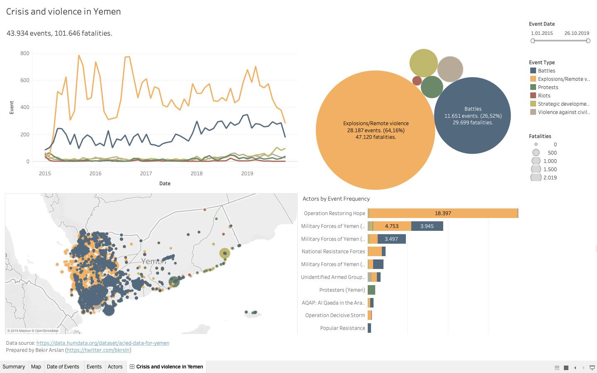

# Yemen'deki kriz ve şiddet olayları
2011 yılında başlayan Arap Baharı sonrası karışan ülkelerden biri de Yemen'di. O günden bu yana devam eden krizde binlerce insan hayatını kaybetti, binlercesi de evini kaybederek mülteci olmak zorunda kaldı. Küresel güçlerin vekalet savaş arenasına dönüşen ülkede bugün hala kriz çözülebilmiş değil.

BM OCHA verilerini kullanarak 2015 ile 2019 yılları arasında ülkede meydana gelen şiddet olaylarını türlerine, aktörlerine ve yerlerine göre Tableau aracını kullanarak görselleştirdim.

:yemen: Veri seti olarak HDX üzerinde yayınlanan [bu sayfadaki](https://data.humdata.org/dataset/acled-data-for-yemen) CSV dosyasını kullandım.

:bar_chart: Görselleştirmeyi interaktif olarak [buradan](https://public.tableau.com/views/CrisisandviolenceinYemen/Dashboard) inceleyebilirsiniz.

:airplane: 2017 yılında gerçekleştirdiğim Yemen seyahatimle alakalı yazıları ise [buradan](https://medium.com/yolyemekssk/kavganin-ortasinda-kalan-yemene-yolculuk-66bbc3b250d6) ve [buradan](https://medium.com/yolyemekssk/hucrede-tutulan-iki-yardim-gorevlisinin-yemen-yolculugu-903335444709) okuyabilirsiniz.

---

